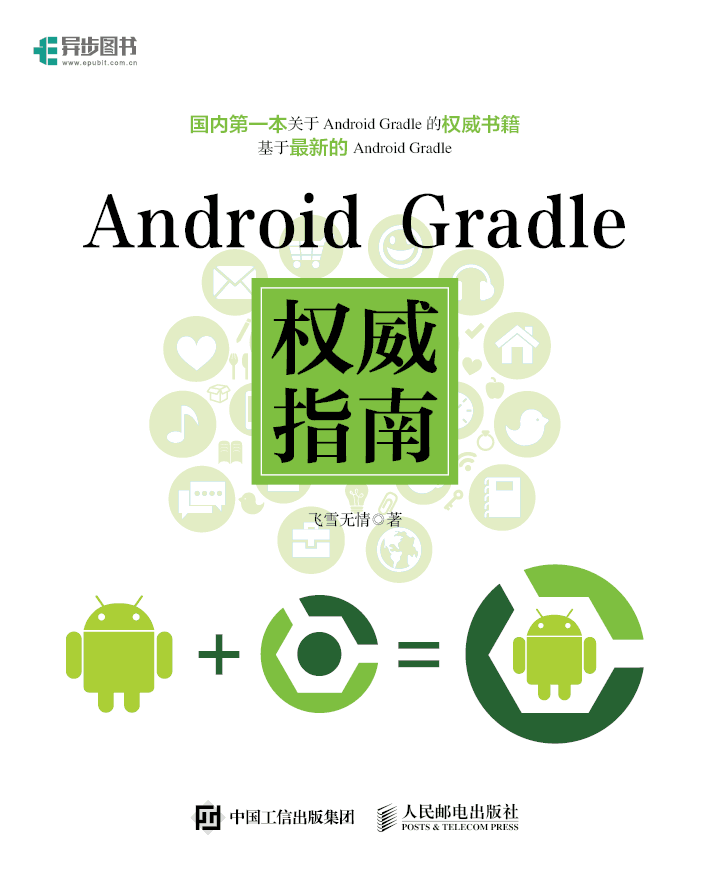

Android官方技术文档翻译,原文[Android Tech Docs](http://tools.android.com/tech-docs)

目前 Android Gradle指南已经翻译完成，其他的还在进行中，想参与翻译的朋友可以联系我，领取翻译任务。

## Android Gradle 权威指南

**该项目已经形成一本书《Android Gradle 权威指南》，比原官方文档更细，更全面，更权威，是国内第一本关于Android Gradle的权威书籍**

* 百度阅读电子版地址：[https://yuedu.baidu.com/ebook/14a722970740be1e640e9a3e](https://yuedu.baidu.com/ebook/14a722970740be1e640e9a3e)
* 人民邮电出版社购买地址：[http://www.epubit.com.cn/book/details/4889](http://www.epubit.com.cn/book/details/4889)

## 联系方式

* 联系人：飞雪无情
* 邮箱：<ls8707@gmail.com>
* 博客：[http://www.flysnow.org/](http://www.flysnow.org/)

想参与翻译的朋友看这里[https://github.com/rujews/android-tech-docs/issues/3](https://github.com/rujews/android-tech-docs/issues/3)

## 以下是文档目录

* [Ant 任务](ant-tasks.md)
* [Ant 构建脚本](ant-build-script.md)
* [新的Android SDK构建系统](new-build-system/README.md)
* [Experimental New Android Tool Chain - Jack and Jill](jackandjill.md)
* [tools属性(Tools Attributes)](tools-attributes.md)
* [注解支持(Support Annotations)](support-annotations.md)
* [Project Sync Issues (Android Studio)](project-sync-issues-android-studio.md)
* [Configuring Android Studio: JDK, VM options, IDE properties](configuration/README.md)
    * [Mac OSX JDK Selection](configuration/osx-jdk.md)
