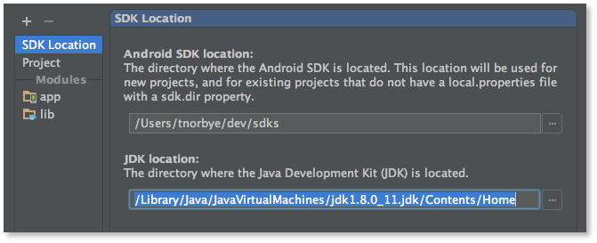
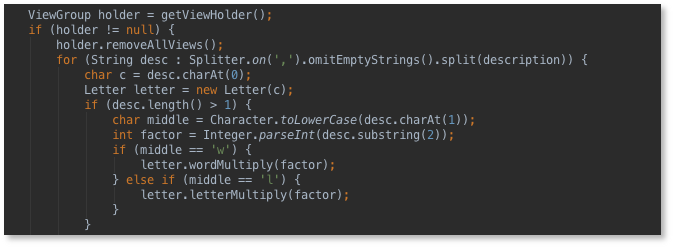
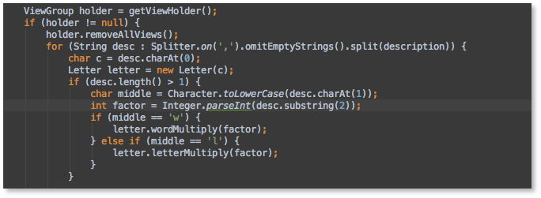

以下内容由[liuling07](https://github.com/liuling07)提供翻译

原文地址 <http://tools.android.com/tech-docs/configuration/osx-jdk>

# Mac OSX下JDK的选择

Android Studio需要两个不同的JDK：
* IDE工具自己运行所需要的Java版
* 提供Java编译器的JDK版

这两者可以为（通常也是）同一个，当然你也可以单独配置它们。但是在OSX系统上有点特殊，它们需要使用不同的JDK。

#### 工程的JDK

你可以在工程结构对话框中配置用来编译代码的JDK，这个JDK将用来获得一个编译你的代码的编译器。如果你正在使用compileSdkVersion大于或等于21的版本构建项目的话，你应该使用JDK7或者JDK8。你也可以通过编辑工程里的local.properties文件来配置JDK的路径。



#### IDE的JDK

在Mac的OSX系统中，运行IDE的Java版本通常是自动选择的，这个选择是基于IDE安装目录下的Info.plist文件中的一个实体。切记，不要尝试去通过修改Info.plist文件来选择不同的JDK版本。这不但会影响你应用程序的签名，而且还会影响你将来的补丁升级。就像[IDE配置文档](http://tools.android.com/tech-docs/configuration)所描述的那样，你可以通过设置环境变量$STUDIO_JDK来选择不同的JDK版本。

在Mac的OSX系统中，默认运行IDE（非编译代码）的是Java6。主要是因为Java6中字体的渲染可以使用完整的亚像素液晶抗锯齿，而Java7或者Java8却不行。

下面是Java8中的代码片段：



下面是Java6中关于IDE运行的代码片段：



如果有没有找到可度的Java6，也可以使用Java8，因为Java8中很多东西都是最新的。就像[IDE配置文档](http://tools.android.com/tech-docs/configuration)所描述的那样，你可以像这样来运行它们：

```
$ export STUDIO_JDK=/Library/Java/JavaVirtualMachines/jdk1.8.0_25.jdk
$ open /Applications/Android\ Studio.app
```

（如果你对他们的区别比较好奇：Java6通过Quartz来执行渲染工作，除了轻微的改变颜色之外，字体也是通过亚像素液晶抗锯齿来渲染的。这有可能是JDK的一个bug，<https://bugs.openjdk.java.net/browse/JDK-8023794>）。

#### 安装Java6

如果你双击Android Studio的安装包，Mac OSX可能会自动出现一个安装Java的对话框。如果没有的话，你可以从下面的页面下载获得：<http://support.apple.com/kb/DL1572>

#### Mac OSX 10.10的一些问题

据说在Mac OSX 10.10中运行Android Studio会有图形绘制和其他的一些bug。

<https://code.google.com/p/android/issues/detail?id=78292> 

<https://code.google.com/p/android/issues/detail?id=78139>

首先，请确认你是否安装了最新版本的Java6；在某些情况下已经修复了这个问题：

<http://support.apple.com/kb/DL1572>

如果没有，请按照上面描述的那样通过设置STUDIO_JDK运行Java7或者Java8最新的一个版本。据说其他问题已经被修复了（但是你所看到的字体是像上面Java8那样渲染的。）
