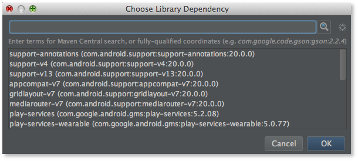
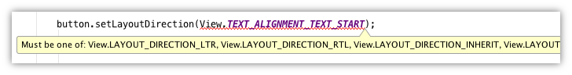
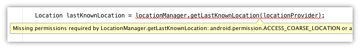
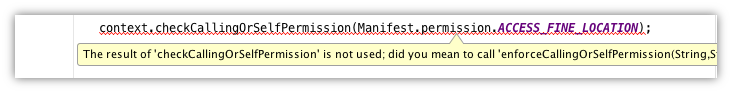

以下内容由[飞雪无情](http://www.flysnow.org)提供翻译

原文地址 <http://tools.android.com/tech-docs/support-annotations>

## 注解支持(Support Annotations)

Android support library从19.1版本开始引入了一个新的注解库，它包含很多有用的元注解，你能用它们修饰你的代码，帮助你发现bug。Support library自己本身也用到了这些注解，所以作为support library的用户，Android Studio已经基于这些注解校验了你的代码并且标注其中潜在的问题。Support library 22.2版本又新增了13个新的注解以供使用。

### 使用注解库

注解默认是没有包含的；他们被包装成一个独立的库。（support library现在由一些更小的库组成：v4-support, appcompat, gridlayout, mediarouter等等）

(如果你正在使用appcompat库，那么你已经可以使用这些注解了，因为appcomat它自己也依赖它。)

添加使用注解最简单的方式就是打开Project Structure对话框。首先在左边选中module，然后在右边选中Dependencies标签页，点击面板底部的`+`按钮，选择Library Dependency，假设你已经把Android Support Repository安装到你的SDK中了，那么注解库将会出现在列表中，你只需点击选中它即可(这里是列表中的第一个):

点击OK完成Project Structure的编辑。这会修改你的build.gradle文件，当然你也可以手动编辑它：

    dependencies {
        compile 'com.android.support:support-annotations:22.2.0'
    }

对于Android application和Android library这两个类型的module(你应用了`com.android.application`或者`com.android.library`插件的)来说，你需要做的已经都做好了。如果你想只在Java module使用这些注解，那么你就明确的包含SDK仓库了，因为support libraries不能从jcenter获得(Android Gradle插件会自动的包含这些依赖，但是Java插件却没有。)

    repositories {
       jcenter()
       maven { url '<your-SDK-path>/extras/android/m2repository' }
    }

### 执行注解

当你用Android Studio和IntelliJ的时候，如果给标注了这些注解的方法传递错误类型的参数，那么IDE就会实时标记出来。

从Gradle插件1.3.0-beta1版本开始，并且安装了Android M Preview平台工具的情况下，通过命令行调用gradle的`lint`任务就可以执行这些检查。如果你想把标记问题作为持续集成的一部分，那么这种方式是非常有用的。说明：这并不包含nullness注解。本文中所介绍的其他注解都可以通过lint执行检查。

### Nullness Annotations

@Nullable注解能被用来标注给定的参数或者返回值可以为null。
类似的，@NonNull注解能被用来标注给定的参数或者返回值不能为null。

如果一个本地变量的值为null(比如因为过早的代码检查它是否为null)，而你又把它作为参数传递给了一个方法，并且该方法的参数又被@NonNull标注，那么IDE会提醒你，你有一个潜在的崩溃问题。

    v4 support library中的FragmentActivity的示例代码：

    import android.support.annotation.NonNull;
    import android.support.annotation.Nullable;
    ...

    /**
     * Add support for inflating the &lt;fragment> tag.
     */
    @Nullable
    @Override
    public View onCreateView(String name, @NonNull Context context, @NonNull AttributeSet attrs) {
    ...
(如果你执行Analyze > Infer Nullity，或者你在键入时把@NonNull替换成了@NotNull，那么IDE可能会提供附加的IntelliJ注解。参考底部的“IntelliJ Annotations”段落了解更多)

注意@NonNull和@Nullable并不是对立的：还有第三种可能：未指定。当你没有指定@NonNull或者@Nullable的时候，工具就不能确定，所以这个API也就不起作用。

最初，我们在findViewById方法上标注@Nullable，从技术上说，这是正确的：findViewById可以返回null。但是如果你知道你在做什么的时候(如果你传递给他一个存在的id)他是不会返回null的。当我们使用@Nullable注解它的时候，就意味着源代码编辑器中会有大量的代码出现高亮警告。如果你已经意识到每次使用该方法都应该明确的进行null检查，那么就只能用@Nullable标注返回值。有个经验规则：看现有的“好的代码”(比如审查产品代码)，看看这些API是怎么被使用的。如果该代码为null检查结果，你应该为方法注解@Nullable。

### 资源类型注解

Android的资源值通常都是使用整型传递。这意味着获取一个drawable使用的参数，也能很容易的传递给一个获取string的方法；因为他们都是int类型，编译器很难区分。

资源类型注解可以在这种情况下提供类型检查。比如一个被@StringRes住进诶的int类型参数，如果传递一个不是R.string类型的引用将会被IDE标注：

以ActionBar为例:

    import android.support.annotation.StringRes;
    ...
    public abstract void setTitle(@StringRes int resId);

有很多不同资源类型的注解：如下的每一个Android资源类型：
@StringRes, @DrawableRes, @ColorRes, @InterpolatorRes,等等。一般情况下，如果有一个`foo`类型的资源，那么它的相应的资源类型注解就是FooRes.

除此之外，还有一个名为@AnyRes特殊的资源类型注解。它被用来标注一个未知的特殊类型的资源，但是它必须是一个资源类型。比如在框架中，它被用在`Resources#getResourceName(@AnyRes int resId)`上，使用的时候，你可以这样`getResources().getResourceName(R.drawable.icon)`用，也可以`getResources().getResourceName(R.string.app_name)`这样用，但是却不能这样`getResources().getResourceName(42)`用。

请注意，如果你的API支持多个资源类型，你可以使用多个注解来标注你的参数。

### IntDef/StringDef: 类型定义注解

整型除了可以作为资源的引用之外，也可以用作“枚举”类型使用。

@IntDef和"typedef"作用非常类似，你可以创建另外一个注解，然后用@IntDef指定一个你期望的整型常量值列表，最后你就可以用这个定义好的注解修饰你的API了。

appcompat库里的一个例子：

    import android.support.annotation.IntDef;
    ...
    public abstract class ActionBar {
    ...
    @IntDef({NAVIGATION_MODE_STANDARD, NAVIGATION_MODE_LIST, NAVIGATION_MODE_TABS})
    @Retention(RetentionPolicy.SOURCE)
    public @interface NavigationMode {}

    public static final int NAVIGATION_MODE_STANDARD = 0;
    public static final int NAVIGATION_MODE_LIST = 1;
    public static final int NAVIGATION_MODE_TABS = 2;

    @NavigationMode
    public abstract int getNavigationMode();

    public abstract void setNavigationMode(@NavigationMode int mode);

上面非注解的部分是现有的API。我们创建了一个新的注解(NavigationMode)并且用@IntDef标注它,通过@IntDef我们为返回值或者参数指定了可用的常量值。我们还添加了`@Retention(RetentionPolicy.SOURCE)`告诉编译器这个新定义的注解不需要被记录在生成的.class文件中(译者注：源代码级别的，生成class文件的时候这个注解就被编译器自动去掉了)。

使用这个注解后，如果你传递的参数或者返回值不在指定的常量值中的话，IDE将会标记出这种情况。

你也可以指定一个整型是一个标记性质的类型；这样客户端代码就通过|，&等操作符同时传递多个常量了：

    @IntDef(flag=true, value={
            DISPLAY_USE_LOGO,
            DISPLAY_SHOW_HOME,
            DISPLAY_HOME_AS_UP,
            DISPLAY_SHOW_TITLE,
            DISPLAY_SHOW_CUSTOM
    })
    @Retention(RetentionPolicy.SOURCE)
    public @interface DisplayOptions {}

最后，还有一个字符串版本的注解，就是@StringDef，它和@IntDef的作用基本上是一样，所不同的是它是针对字符串的。该注解一般不常用，但是有的时候非常有用，比如在限定向Activity#getSystemService方法传递的参数范围的时候。

要了解关于类型注解的更多详细信息，请参考
<https://developer.android.com/tools/debugging/annotations.html#enum-annotations>

(这些都是建立在IntelliJ's MagicConstant注解的基础上，你可以在这里找到该注解的详细信息：<http://blog.jetbrains.com/idea/2012/02/new-magic-constant-inspection/>)

### 线程注解: @UiThread, @WorkerThread, ...

(Support library 22.2及其之后版本支持.)

如果你的方法只能在指定的线程类型中被调用，那么你就可以使用以下4个注解来标注它：

* @UiThread
* @MainThread
* @WorkerThread
* @BinderThread

如果一个类中的所有方法都有相同的线程需求，那么你可以注解类本身。比如android.view.View，就被用@UiThread标注。

关于线程注解使用的一个很好的例子就是AsyncTask：

    @WorkerThread
    protected abstract Result doInBackground(Params... params);

    @MainThread
    protected void onProgressUpdate(Progress... values) {
    }

如果你在重写的doInBackground方法里尝试调用onProgressUpdate方法或者View的任何方法，IDE工具就会马上把它标记为一个错误：

@UiThread还是@MainThread?

在进程里只有一个主线程。这个就是@MainThread。同时这个线程也是一个@UiThread。比如activity的主要窗口就运行在这个线程上。然而它也有能力为应用创建其他线程。这很少见，一般具备这样功能的都是系统进程。通常是把和生命周期有关的用@MainThread标注，和View层级结构相关的用@UiThread标注。但是由于@MainThread本质上是一个@UiThread，而大部分情况下@UiThread又是一个@MainThread，所以工具(lint ,Android Studio,等等)可以把他们互换，所以你能在一个可以调用@MainThread方法的地方也能调用@UiThread方法，反之亦然。

### RGB颜色整型

当你的API期望一个颜色资源的时候，可以用@ColorRes标注，但是当你有一个相反的使用场景时，这种用法就不可用了，因为你并不是期望一个颜色资源id，而是一个真实的RGB或者ARGB的颜色值。

在这种情况下，你可以使用@ColorInt注解，表示你期望的是一个代表颜色的整数值：

    public void setTextColor(@ColorInt int color)

有了这个，当你传递一个颜色id而不是颜色值的时候，lint就会标记出这段不正确的代码：

### 值约束: @Size, @IntRange, @FloatRange

如果你的参数是一个float或者double类型，并且一定要在某个范围内，你可以使用@FloatRange注解：

	public void setAlpha(@FloatRange(from=0.0, to=1.0) float alpha) {

如果有人使用该API的时候传递一个0-255的值，比如尝试调用setAlpha(128)，那么工具就会捕获这一问题：

(你也可以指定是否包括起始值。)

同样的，如果你的参数是一个int或者long类型，你可以使用@IntRange注解约束其值在一个特定的范围内：

	public void setAlpha(@IntRange(from=0,to=255) int alpha) { … }

把这些注解应用到参数上是非常有用的，因为用户很有可能会提供错误范围的参数，比如上面的setAlpha例子，有的API是采用0-255的方式，而有的是采用0-1的float值的方式。

最后，对于数据、集合以及字符串，你可以用@Size注解参数来限定集合的大小(当参数是字符串的时候，可以限定字符串的长度)。

举几个例子

* 集合不能为空: @Size(min=1)
* 字符串最大只能有23个字符: @Size(max=23)
* 数组只能有2个元素: @Size(2)
* 数组的大小必须是2的倍数 (例如图形API中获取位置的x/y坐标数组: @Size(multiple=2)

### 权限注解: @RequiresPermission

如果你的方法的调用需要调用者有特定的权限，你可以使用@RequiresPermission注解：

	@RequiresPermission(Manifest.permission.SET_WALLPAPER)
	public abstract void setWallpaper(Bitmap bitmap) throws IOException;

如果你至少需要权限集合中的一个，你可以使用anyOf属性：

	@RequiresPermission(anyOf = {
    	Manifest.permission.ACCESS_COARSE_LOCATION,
        Manifest.permission.ACCESS_FINE_LOCATION})
	public abstract Location getLastKnownLocation(String provider);

如果你同时需要多个权限，你可以用allOf属性：

	@RequiresPermission(allOf = {
    	Manifest.permission.READ_HISTORY_BOOKMARKS,
    	Manifest.permission.WRITE_HISTORY_BOOKMARKS})
	public static final void updateVisitedHistory(ContentResolver cr, String url, boolean real) {

对于intents的权限，可以直接在定义的intent常量字符串字段上标注权限需求(他们通常都已经被@SdkConstant注解标注过了):

	@RequiresPermission(android.Manifest.permission.BLUETOOTH)
	public static final String ACTION_REQUEST_DISCOVERABLE =
            "android.bluetooth.adapter.action.REQUEST_DISCOVERABLE";

对于content providers的权限，你可能需要单独的标注读和写的权限访问，所以可以用@Read或者@Write标注每一个权限需求：

	@RequiresPermission.Read(@RequiresPermission(READ_HISTORY_BOOKMARKS))
	@RequiresPermission.Write(@RequiresPermission(WRITE_HISTORY_BOOKMARKS))
	public static final Uri BOOKMARKS_URI = Uri.parse("content://browser/bookmarks");

### 方法重写: @CallSuper

如果你的API允许使用者重写你的方法，但是呢，你又需要你自己的方法(父方法)在重写的时候也被调用，这时候你可以使用@CallSuper标注：

    @CallSuper
    protected void onCreate(@Nullable Bundle savedInstanceState) {

用了这个后，当重写的方法没有调用父方法时，工具就会给予标记提示：

(Android Studio 1.3 Preview 1的lint检查有个关于这个注解的bug，这个bug就是即使是对的重写也会报错，这个bug已经在Preview 2版本修改，可以通过canary channel更新到Preview 2版本。)

### 返回值: @CheckResult

如果你的方法返回一个值，你期望调用者用这个值做些事情，那么你可以使用@CheckResult注解标注这个方法。

你并不需要微每个非空方法都进行标注。它主要的目的是帮助哪些容易被混淆，难以被理解的API的使用者。

比如，可能很多开发者都对String.trim()一知半解，认为调用了这个方法，就可以让字符串改变以去掉空白字符。如果这个方法被@CheckResult标注，工具就会对那些没有使用trim()返回结果的调用者发出警告。

Android中，Context#checkPermission这个方法已经被@CheckResult标注了：

    @(suggest="#enforcePermission(String,int,int,String)")
    public abstract int checkPermission(@NonNull String permission, int pid, int uid);

这是非常重要的，因为有些使用context.checkPermission的开发者认为他们已经执行了一个权限 ---但其实这个方法仅仅只做了检查并且反馈一个是否成功的值而已。如果开发者使用了这个方法，但是又不用其返回值，那么这个开发者真正想调用的可能是这个Context#enforcePermission方法，而不是checkPermission。

### @VisibleForTesting

你可以把这个注解标注到类、方法或者字段上，以便你在测试的时候可以使用他们。

### @Keep

我们还在注解库里添加了@Keep注解，但是Gradle插件还支持（尽管已经在进行中）。被这个注解标注的类和方法在混淆的时候将不会被混淆。

### 在你自己的库中使用注解

如果你在你自己的库中使用了这些注解，并且是通过Gradle构建生成aar包，那么在构建的时候Android Gradle插件会提取注解信息放在AAR文件中供引用你的库的客户端使用。在AAR文件中你可以看到一个名为annotations.zip的文件，这个文件记录的就是注解信息，使用的是IntelliJ的扩展注解XML格式。这是必须的，因为.class文件不能包含足够的要处理以上@IntDef注解的信息；注意我们只需记录该常量的一个引用，而不是它的值。当且仅当你的工程依赖注解库的时候，Android Gradle插件会把提取注解的任务作为构建的一部分执行它。(说明：只有源保留注解被放置在.aar文件中；class级别的会被放在classes.jar里。)

### IntelliJ注解

IntelliJ，Android Studio就是基于它开发的，IntelliJ有一套它自己的注解；IntDef分析其实重用的是MagicConstant分析的代码，IntelliJ null分析其实用的是一组配置好的null注解。如果你执行Analyze > Infer Nullity...，它会试图找出所有的null约束并添加他们。这个检查有时会插入IntelliJ注解。你可以通过搜索,替换为Android注解库的注解，或者你也可以直接用IntelliJ注解。在build.gradle里或者通过Project Structure对话框的Dependencies面板都可以添加如下依赖：

    dependencies {
        compile 'com.intellij:annotations:12.0'
    }